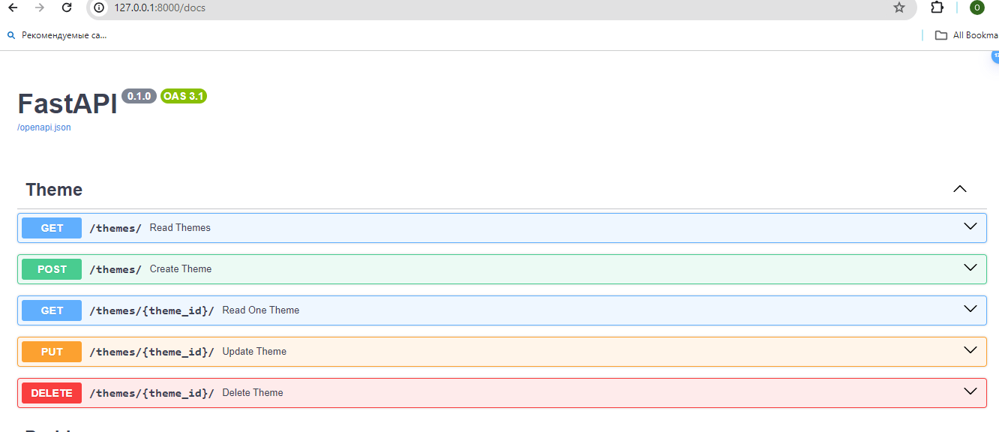
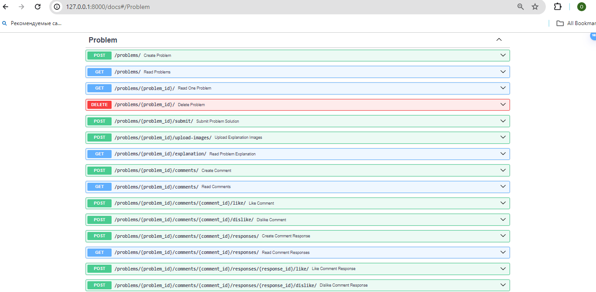
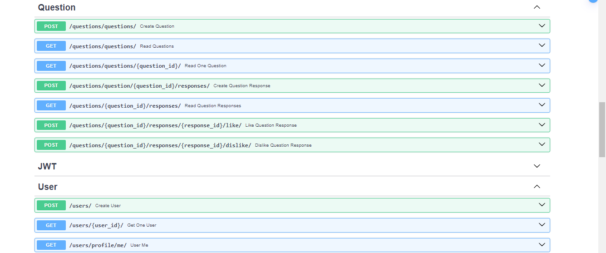

# FastAPI physics
This is a platform for those who has questions to ask or love for solving physics problems, but sometimes get very stuck.

## The rules:
* there are themes (Optics, Mechanics etc)
* each theme has questions and problems
* everybody can post one's questions and comments
* everybody can solve problems
* there are difficulty levels of problems: easy, middle and hard
* each problem solution yields a certain amount of scores to the user: 5, 10 and 20 depending on the difficulty level
* users with 100 scores can create their own problems
* users with 20 scores can like comments
* users with 100 scores can dislike comments

## Features:
* Async SqlAlchemy and asyncpg
* JWT authentication
* pytest
* AWS

## Installation
* Make sure you have Docker
* Create .env and .test.env files and fill them accordingly to .env.sample and .test.env.sample
* Run ```docker build -t physics .```
* Run ```docker run -p 8080:8080 physics```
* Run migrations ```docker exec -it <container id> alembic upgrade head```

## Documentation
Visit /docs to see all the endpoints

## Testing
Well, if you want to run tests, you first have to prepare you testing database in this way:
* Run migrations is it as shown above
* Add two users: first, with username test_user (id should be 1), and second, test_admin (id = 2)
* Run ```pytest```

## Demo:



